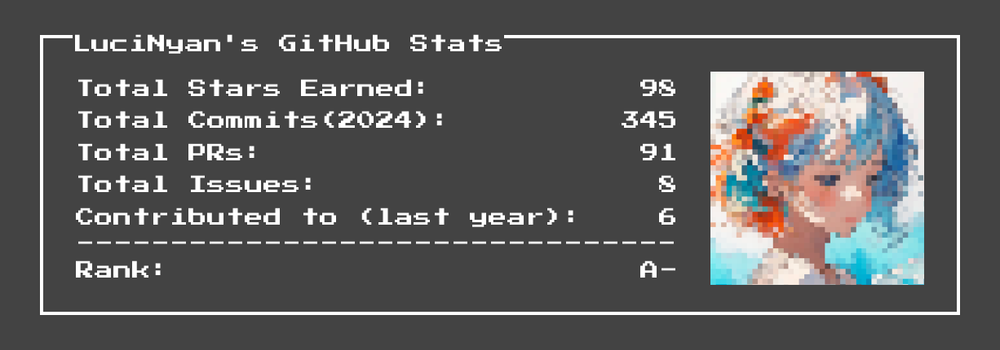
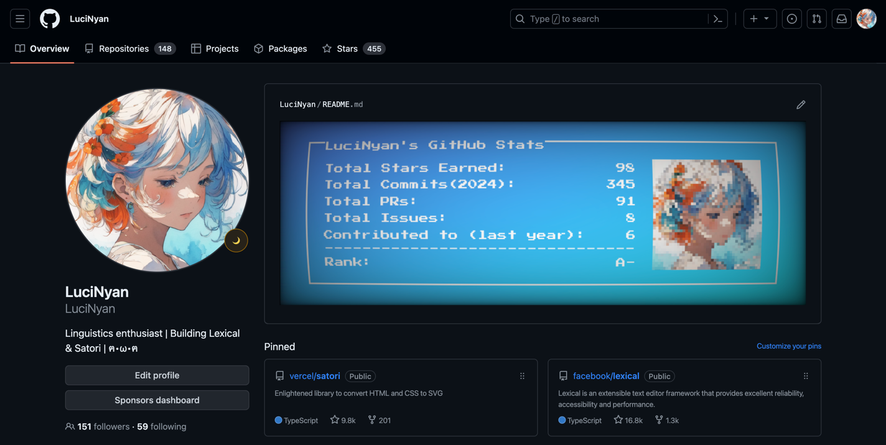
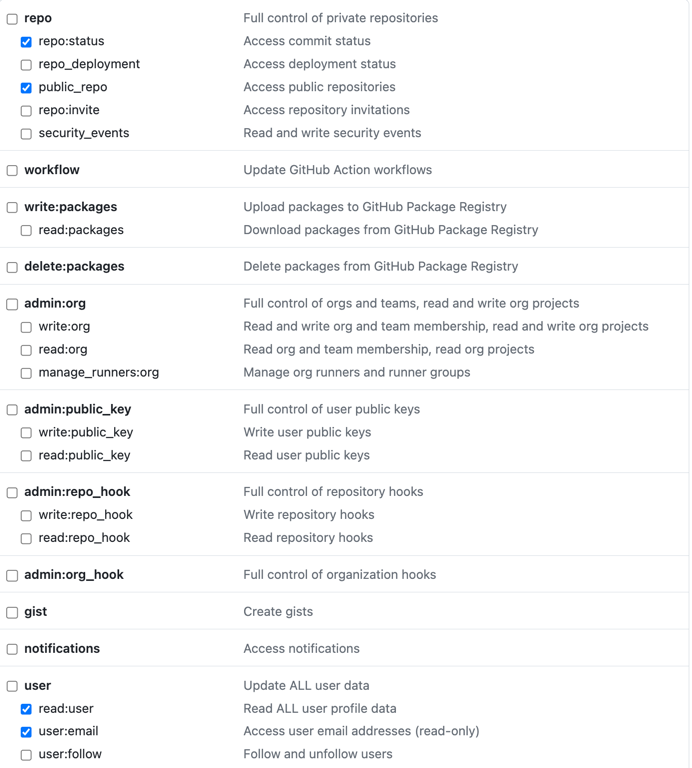
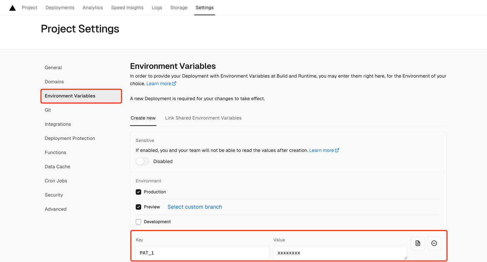

**Pixel Profile**: Generate pixel art profiles from your GitHub data

> This Pixel Profile project would not have been possible without these three amazing projects:
> 
> [Github Readme Stats](https://github.com/anuraghazra/github-readme-stats): One of the best tools out there for generating awesome Github stats cards.
> 
> [resvg-js](https://github.com/yisibl/resvg-js): A high-performance SVG renderer and toolkit.
>
> [Satori](https://github.com/vercel/satori): An enlightened library to convert HTML and CSS to SVG.

## Overview

You can easily generate a Github stats card with default styling using the following link:
```html
<!--Replace <username> with your own GitHub username.-->
https://pixel-profile.vercel.app/api/github-stats?username=<username>
```


Of course, you can customize the styling to better suit your preferences. For example, here is a stats card designed for GitHub's Dark Theme::
```html
https://pixel-profile.vercel.app/api/github-stats?username=LuciNyan&screen_effect=true&background=linear-gradient(to%20bottom%20right%2C%20%232aeeff%2C%20%235580eb)
```
This is what it looks like in use in a README:



If you want to include a GitHub stats card in your own README and have it display the appropriate card for both light and dark themes on GitHub, you can use the following configuration:

```md
<picture decoding="async" loading="lazy">
  <source media="(prefers-color-scheme: light)" srcset="https://pixel-profile.vercel.app/api/github-stats?username=LuciNyan&screen_effect=false&background=linear-gradient(to%20bottom%20right%2C%20%2374dcc4%2C%20%234597e9)">
  <source media="(prefers-color-scheme: dark)" srcset="https://pixel-profile.vercel.app/api/github-stats?username=LuciNyan&screen_effect=true&background=linear-gradient(to%20bottom%20right%2C%20%235580eb%2C%20%232aeeff)">
  
</picture>

```

[Here](https://github.com/LuciNyan) is a ready-made example configuration you can reference if you need inspiration for your own config.

## Documentation
Github Stats Card Options

| Name | Description                  | Default value |
| --- |------------------------------|---------------|
| `username` | GitHub username              | ''            |
| `show_rank` | Display rank value             | `true`        |
| `include_all_commits` | Count all commits            | `false`       |
| `screen_effect` | Enable curved screen effect  | `false`       |
| `show_avatar` | Display avatar                  | `true`        |
| `pixelate_avatar` | Apply pixelation to avatar     | `true`        |
| `color` | Set text color to any valid CSS color value | `white`       |
| `background` | Set background color/image. Supports a subset of CSS background property values    | `#434343`     |

## Deploy on your own

### 1. Deploy on Vercel
The GitHub API has a rate limit of 5k requests per hour. So my https://pixel-profile.vercel.app/api setup could potentially hit that cap. By self-hosting it on Vercel, you eliminate that concern. Simply click "Deploy" to begin seamlessly hosting your own instance!

[](https://vercel.com/import/project?template=https://github.com/LuciNyan/pixel-profile)

### 2. Creating a Personal Access Token
To use this tool to retrieve user statistics, you'll need to generate a Personal Access Token (PAT) with the proper scopes.

Click [here](https://github.com/settings/tokens/new) to create a new PAT.

Under "Select scopes" check the box for "repo" and "user" like in the image below:



Copy the generated PAT for use in the config file or as an environment variable.

### 3. Using the PAT with Vercel
Once you have generated a Personal Access Token (PAT) from your GitHub account, you'll need to add it to your Vercel project configuration in order to authenticate API requests.

To add the PAT to Vercel:




## Contribute
The layout in this project is entirely done with JSX, so developing it is almost no different than a normal React project. This means anyone can easily create new cards with very little effort. If you have any ideas, feel free to contribute them here! ❤️

### TODO
- [X] Github stats card.
- [ ] READEME: how to deploy on Vercel.
- [ ] Github repo card.
- [ ] Leetcode stats card.

## Author

- [LuciNyan](https://github.com/LuciNyan)

&nbsp;

<a aria-label="Vercel logo" href="https://vercel.com">
  
</a>
