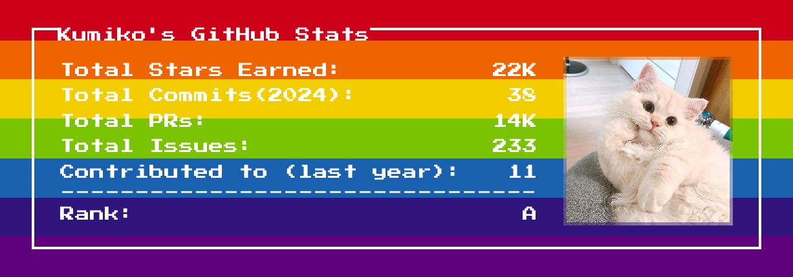
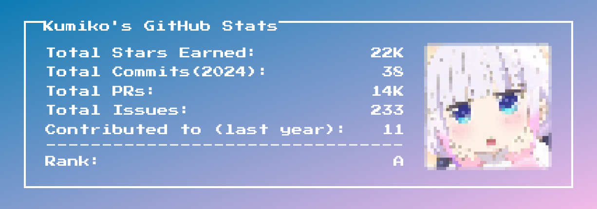

**Pixel Profile**: Generate pixel art profiles from your GitHub data

> 🎉🎉🎉 [Halid](https://github.com/imhalid) has created an awesome [UI](https://github.com/imhalid/pixel-profile-generator) for pixel-profile, which makes it a breeze to edit our own GitHub cards!
>
> Check it out! ✨ https://pixel-profile-generator.vercel.app

> This Pixel Profile project would not have been possible without these amazing projects:
> 
> [Github Readme Stats](https://github.com/anuraghazra/github-readme-stats): One of the best tools out there for generating awesome Github stats cards.
> 
> [resvg-js](https://github.com/yisibl/resvg-js): A high-performance SVG renderer and toolkit.
>
> [Satori](https://github.com/vercel/satori): An enlightened library to convert HTML and CSS to SVG.
> 
> [Jubilee](https://ko-fi.com/8pxl) A truly unmatched pixel artist! ❤️

## Overview

You can easily generate a Github stats card with default styling using the following link:
```html
<!--Replace <username> with your own GitHub username.-->
https://pixel-profile.vercel.app/api/github-stats?username=<username>
```


Of course, you can customize the styling to better suit your preferences. For example, here is a stats card designed for GitHub's Dark Theme::
```html
https://pixel-profile.vercel.app/api/github-stats?username=LuciNyan&screen_effect=true&theme=rainbow
```
This is what it looks like in use in a README:


If you want to include a GitHub stats card in your own README file and have it display the appropriate card for both the light and dark themes on GitHub, you can refer to the following configuration and configure your preferred theme, or fully customize elements like color, background, screen effects, etc:

```md
<picture decoding="async" loading="lazy">
  <source media="(prefers-color-scheme: light)" srcset="https://pixel-profile.vercel.app/api/github-stats?username=LuciNyan&theme=summer">
  <source media="(prefers-color-scheme: dark)" srcset="https://pixel-profile.vercel.app/api/github-stats?username=LuciNyan&screen_effect=true&theme=blue_chill">
  
</picture>
```

[Here](https://github.com/LuciNyan) is a ready-made example configuration you can reference if you need inspiration for your own config.

## Documentation
### Themes
Below are some prebuilt themes to get started. However, cards are fully customizable by passing in background and color props. Feel free to ditch the premade themes and design unique cards by selecting your own colors and backgrounds!
#### 1. Journey without pixelated avatar.

```html
https://pixel-profile.vercel.app/api/github-stats?username=LuciNyan&theme=journey&pixelate_avatar=false
```

#### 2. Road trip without pixelated avatar.

```html
https://pixel-profile.vercel.app/api/github-stats?username=LuciNyan&theme=road_trip&pixelate_avatar=false
```

#### 3. Fuji without pixelated avatar.

```html
https://pixel-profile.vercel.app/api/github-stats?username=LuciNyan&theme=fuji&pixelate_avatar=false
```

#### 4. Rainbow without pixelated avatar.

```html
https://pixel-profile.vercel.app/api/github-stats?username=LuciNyan&theme=rainbow&pixelate_avatar=false
```

#### 5. Monica.

```html
https://pixel-profile.vercel.app/api/github-stats?username=LuciNyan&theme=monica
```

#### 6. Summer.

```html
https://pixel-profile.vercel.app/api/github-stats?username=LuciNyan&theme=summer
```

#### 7. Lax.

```html
https://pixel-profile.vercel.app/api/github-stats?username=LuciNyan&theme=lax
```


### Github Stats Card Options

| Name                  | Description                                                                                                                                           | Default value |
|-----------------------|-------------------------------------------------------------------------------------------------------------------------------------------------------|---------------|
| `background`          | Set background color/image. Supports a subset of CSS background property values                                                                       | `#434343`     |
| `color`               | Set text color to any valid CSS color value                                                                                                           | `white`       |
| `hide`                | Hide specific stats or elements by passing a comma-separated list. Valid keys: 'avatar', 'commits', 'contributions', 'issues', 'prs', 'rank', 'stars' |               |
| `include_all_commits` | Count all commits                                                                                                                                     | `false`       |
| `pixelate_avatar`     | Apply pixelation to avatar                                                                                                                            | `true`        |
| `screen_effect`       | Enable curved screen effect                                                                                                                           | `false`       |
| `username`            | GitHub username                                                                                                                                       | ''            |
| `theme`               | Check out the built-in themes below                                                                                                                   | ''            |


### Hiding individual stats

You can pass a query parameter `&hide=` to hide any specific stats with comma-separated values.

> Options: `&hide=avatar,commits,contributions,issues,prs,rank,stars`
```html
<!--Replace <username> with your own GitHub username.-->
https://pixel-profile.vercel.app/api/github-stats?username=<username>&hide=rank
```


## Deploy on your own

The GitHub API has a rate limit of 5k requests per hour. So my https://pixel-profile.vercel.app/api setup could potentially hit that cap. By self-hosting, you eliminate that concern. 

### Deploy on Vercel (Recommend)

#### 1. Creating a Personal Access Token
To use this tool to retrieve user statistics, you'll need to generate a Personal Access Token (PAT) with the proper scopes.

Click [here](https://github.com/settings/tokens/new) to create a new PAT.

Under "Select scopes" check the box for "repo" and "user" like in the image below:


Copy the generated PAT for use in the config file or as an environment variable.

#### 2. Deploy to Vercel
[](https://vercel.com/new/clone?repository-url=https%3A%2F%2Fgithub.com%2FLuciNyan%2Fpixel-profile&env=PAT_1&envDescription=To%20use%20this%20tool%20to%20retrieve%20user%20statistics%2C%20you'll%20need%20to%20generate%20a%20Personal%20Access%20Token%20(PAT)%20with%20the%20proper%20scopes.&envLink=https%3A%2F%2Fgithub.com%2FLuciNyan%2Fpixel-profile%3Ftab%3Dreadme-ov-file%231-creating-a-personal-access-token)

#### 3. Using the PAT with Vercel
Once you have generated a Personal Access Token (PAT) from your GitHub account, you'll need to add it to your Vercel project configuration in order to authenticate API requests.

To add the PAT to Vercel:


### Other platforms or self-hosted
In addition to Vercel, you can also deploy to other PaaS platforms (e.g. zeabur.com, heroku.com, fly.io) or hosted on your own server!

#### Deploy on Zeabur
First you need to have a [zeabur](zeabur.com) account.

Fork this repository and log in to Zeabur.

"Create a Project (or select an existing one)" - "Add Service" - "Git" - "Select the forked `pixel-profile` repository".


Don't forget to add your "Personal Access Token (PAT) " in "Variable".


Finally, go to "Networking" and generate a domain (or bind your own).


#### Running on docker
> [!WARNING]  
> When hosting on Docker, caching is not available, which can quickly cause the API rate limits to be exceeded. It is recommended to use Nginx or a CDN as a proxy to provide caching functionality and optimize performance.

```bash
# Clone repository
git clone https://github.com/LuciNyan/pixel-profile.git

# Go to the directory to build the Docker image
cd pixel-profile
docker build -t pixel-profile .

# Create and start the container
docker run -d \
  --name pixel-profile \
  -p 3000:3000 \
  -e PAT_1=ghp_xxxxxx \ # Please change it to your "Personal Access Token (PAT) "
  -e PORT=3000 \
  --restart always \
  pixel-profile

# The service has successfully started on port 3000!

```

## Contribute
The layout in this project is entirely done with JSX, so developing it is almost no different than a normal React project. This means anyone can easily create new cards with very little effort. If you have any ideas, feel free to contribute them here! ❤️

### Running Locally
Follow these 4 easy steps to get `pixel-profile` running on your local machine:

#### 1. Install dependencies
```shell
pnpm install
```

#### 2. Generate a Personal Access Token (PAT)
Refer to the "Creating a Personal Access Token" section above.

#### 3. Create a .env file
Use .env.example as a guide to set your environment variables.
```markdown
PAT_1=xxxxxxx
```

#### 4. Run! 🚀
```shell
pnpm start
```

### TODO
- [X] Github stats card.
- [ ] Github repo card.
- [ ] Leetcode stats card.

## Author

- [LuciNyan](https://github.com/LuciNyan)

&nbsp;

<a aria-label="Vercel logo" href="https://vercel.com">
  
</a>
